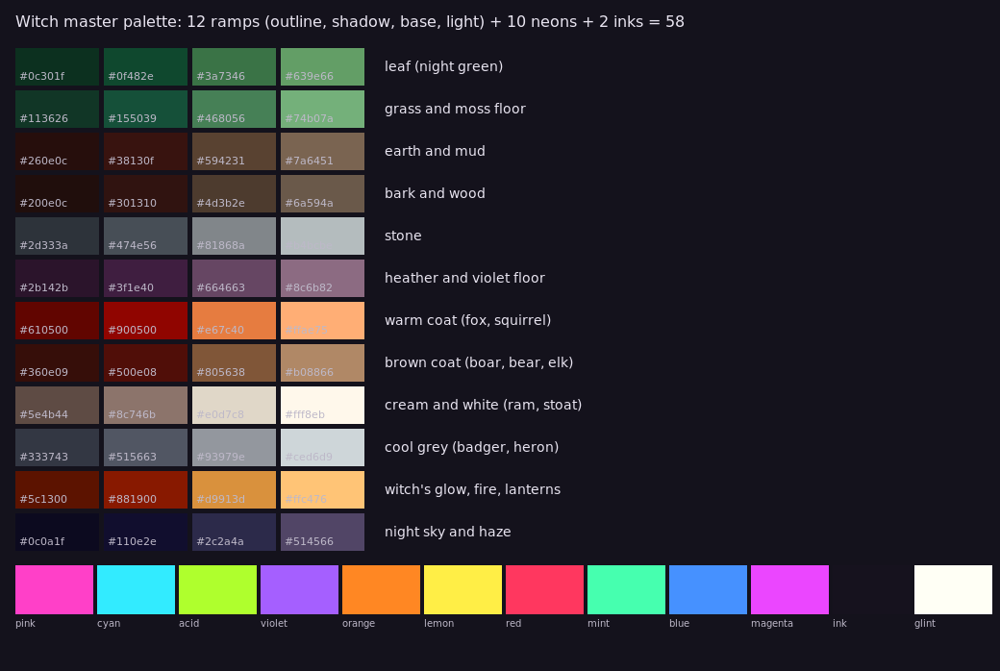
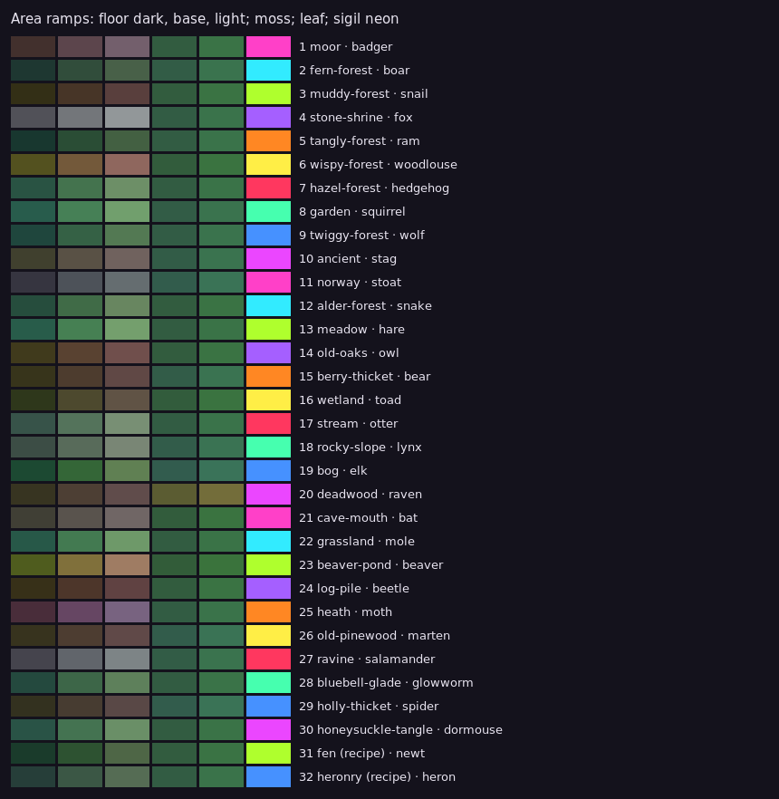
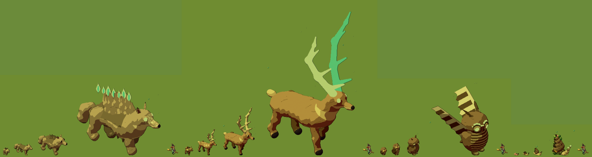

# Witch style bible

The rules every piece of art in Witch follows, so that the whole scene reads as one pixel-art picture. Builders apply it; reviewers check against it. It is short on purpose: each rule says what to do, how to check it, and where today's game breaks it. The long reasoning and the history of reviews are in `docs/ART-GUIDE.md`; the facts behind every number here (with file and line) were gathered from the code on 2026-10-07.

**Ed's rulings it rests on**
- "Everything should look a bit more pixel-art stylised" (2026-10-05), and "everything should be pixellated to the same level (including the menu)" (2026-10-06).
- "I think I prefer bold style" (2026-10-06): **bold is the game's default** (`?style=bold`; `ref` and `now` stay selectable).
- Art pixel: **5** (Ed, 2026-10-07, after the px 3/4/5 comparison of seven scenes). It was "4 or 5, but we will decide in playtesting" (2026-10-05) and ran at 3 until then. `?px=3` or `?px=4` still switches it for one load.
- "Light and glow stay smooth"; "creature projectiles and the leyline and pulse are not pixelated. Lighting effects can be non-pixel but they should be lighting objects that are pixels" (round 14). "No dithering" (the canopy and trunk fades).
- "Animal legs have outlines on them; they'd look better without" (2026-10-06).

---

## 1. The grid and the art pixel

One art pixel is `1 / (artPixelsPerMetre × 2 / pixelSize)` metres: **0.094 m at px 3, 0.125 m at px 4, 0.156 m at px 5**. The witch is about **4.2 m** tall at every pixel size (her body is 45 art px at px 3, 34 at 4, 27 at 5).

Rules:
1. **Everything is baked at the game's art pixel and drawn at a whole scale.** A sprite's `scale` is 1 (or a whole number); its size comes from the bake, never from a fractional draw scale. Squash and stretch (`sx`, `sy`) are already rounded to whole art pixels; breathing, popping and growing must be done that way too.
2. **One density.** Art drawn at a fixed 16 px per metre (paths, the dancefloor, attack effects, ground sigils) is a second pixel size beside the sprites' 10.7 px per metre at px 3. Bake it at the sprites' density.
3. **Light may be smooth; objects may not.** Glows, bloom, haze, mist, the ley line and projectiles' light are smooth light. Anything that is a thing (a creature, a prop, a dot drawn as an object) is hard-edged art pixels on the grid.

Where the game breaks rule 1 today (each is a ticket for the builder who owns it):

| What | Draw scale now | Owner area |
|---|---|---|
| Wild legends | 1.35, breathing ±4% (**fixed by #363**: 1, breath as a whole-pixel squash) | legends |
| Set pieces | `setPieceScale` 1.8 | scenery |
| Rune markers | `runeMarkers.scale` 2.25 | markers |
| Home speaker boot stones | 0.55 (**fixed**: baked at 0.55 of a rune stone, `SPEAKER_STONE`, drawn at 1; the speaker tops' 0.96 is only its laser's height, not a draw scale) | home |
| Tall trees | squeezed by `treeCap` past 20 m | trees |
| Party objects and their campfires | their pop-in `scale` (**fixed**: they pop and grow by `sx`/`sy`, whole art pixels) | party |
| Beach plants, berries (their regrowth and the nibble's sparkles), an evolving pop | per-instance `scale` | beach, berries |

The camera is a perspective camera, so an art pixel is about 1.1 screen pixels at Ed's 1240-high window at the starting zoom (0.64 at 720 high, 0.43 from the treetops). That resampling is accepted: the rule is about what we bake and draw, not the camera.

## 2. Palette

**The master palette** (`docs/style/palette.json`): 12 ramps of 4 tones (outline, shadow, base, light), the 10 party neons and 2 inks, 58 colours. Each ramp is the bold bake's own hue shift run on one base (art/stylise.js `styleTone`), so a sprite stylised by the bake lands on these tones:
- **shadow**: darker and more saturated, its hue pulled toward blue-violet (.72) by the short way round, so warm colours shadow toward deep red-brown and cool ones toward violet;
- **light**: brighter, less saturated, its hue pulled toward warm cream (.13);
- **outline**: the part's own darkest tone (rule 3 below), never black.

Rules:
1. **3 tones per material, plus its outline tone.** No material shows more than its shadow, base and light in a baked sprite (the bake's 3 bands), and glowing pixels keep their own flat colour.
2. **The darkest colour is ink `#16121e`, never `#000000`.** The whitest is glint `#fffff5`.
3. **Neons are only for magic and the party**: sigils, runes, glows, collars, woken eyes, party lights, the legend's sleeping outline. Never on a coat, a leaf or a floor. (Already a check: only magical materials glow.)
4. **Coats separate from their floor by value first**: dark creatures darker than their floor, pale ones paler (ART-GUIDE §3).

**Per-area ramps.** Every area has its own floor ramp (dark, base, light), its moss, its leaf and its sigil neon, already in the art's data (`groundColours`, `art/areas.js`, `art/sigils.js`); all leaves pass through the night-green shift, so most canopies sit between hues .34 and .42.

A new area takes its floor from one of the 12 ramps' families and hue-shifts it; it must differ from its neighbours' floors in value or hue at a glance, and its neon is dealt so that neighbouring areas never share one.

## 3. Outlines

1. **Selective, in the part's own dark tone**: each part's outline is its own outline tone (bold), broken on the lit upper left. **No black outline anywhere.** (Ref's near-black outline and interior lines stay available as `?style=ref`, not the default.)
2. **No outline on limbs or interiors.** Legs (the rig's leg discs) and parts inside a silhouette get none: under bold the bake draws an outline round every sprite it stylises, discs included, so the leg discs must be marked to skip it (a ticket for the rig's owner; the moonlight rim already skips them).
3. **The outline is never the only thing that separates a creature from its floor**: value first (§2 rule 4), then the moonlight rim.
4. **Plants have no outline** (crowns read by their clusters and light).

## 4. Scale against the witch

The witch is the unit (about 4.2 m; body 45 art px at px 3).

| Thing | Size | Rule from |
|---|---|---|
| Baby | about 0.65 × her (wolf 30 px body) | art/check.mjs level steps |
| Young | about 1 × her (45 px) | young ≥ 1.3 × baby |
| Adult | about 1.6 × her (75 px); the bigger species 1.45 to 2.1 × (elk, stag to 2.5 ×) | adult ≥ 1.55 × young |
| Legend | about 4.5 × her (203 px) | legend ≥ 2.1 × adult |
| Dancefloor speaker | about 2.6 × her (11 m) | check.mjs |
| Soundsystem | about 3 × her (12.7 m) | check.mjs |
| Set pieces | 6 to 12 m (1.4 to 2.9 ×) | check.mjs |
| Big pieces of open areas | 4.5 to 12 m | check.mjs |
| Party relics | 7 to 16 m across | check.mjs |
| Treetops (her flight height) | 24 m (5.7 ×) | `treetopHeight` |
| Treehouse | 28 to 40 m | check.mjs |
| Small objects | at least 0.4 × her (proposed) | ART-GUIDE §5 |
| Tufts | 8 to 13 art px | check.mjs |

Each level is a new design, not a scaled copy (ART-GUIDE §0b); the ratios above are the floor, the silhouette does the rest.

## 5. The readability ladder

What must read first, at a glance, at night. Each rung may use the tools of the rungs below it but not those above, so nothing lower ever out-shouts something higher.

| Rung | What | Its tools (and nothing lower may use them this strongly) |
|---|---|---|
| 1 | **The witch** | her own light and its pool, the strongest moonlight rim, her silhouette shown through whatever hides her, things in front of her faded, the canopy hole round her |
| 2 | **Threats and wind-ups** | red telegraph rings and lanes on the ground, the wind-up crouch and glint, red woken eyes; the only red on the screen besides the red neon |
| 3 | **The ley line and the pulse** | an additive neon ribbon drawn through the trees, the one long line on screen |
| 4 | **Legends** | size, a neon outline asleep (#334), stepped light (#363), a ground glow in their neon; their circles' twilight |
| 5 | **Creatures and sigils** | value against the floor, eyeshine, the moonlight rim, a light floor; sigils and runes in neon |
| 6 | **Props** | shape and value only; no glow unless magic, warm point lights for party decor |
| 7 | **Ground and canopy** | low value and saturation (the night's luminance cap), clusters, no glow; the canopy's party uplight only from below |

Rules:
1. **Brightness and saturation fall with the rung.** Only rungs 1 to 4 reach bloom; rung 7 never does.
2. **Every rung reads in the dark at ground level and from the treetops** (judge both in-game, with `tools/art-style/capture.cjs`).
3. **Overlays follow the world**: the DOM overlays standing in the world (💌s, hearts, bubbles) take the tilt-shift's blur (#325) and hide past the bend (#358); only the HUD sits on top.

## 6. Contact sheets

Every art batch posts sheets, before and after, in the bold style:

| Sheet | How |
|---|---|
| A species at every level, with the witch | `STYLE='{"artStyle":"bold"}' node art/preview.mjs lineup <species> <png>` |
| An area as a set (creature, trees, props, legend) | `node art/preview.mjs areas|sets <list> <png>` |
| Legends asleep, awake, angry, in their circles at night | the contact sheet on #363 (`previews/legend-pixels/`) |
| The styles side by side in play | `npm run build && node tools/art-style/capture.cjs <dir> bold/3,bold/4,bold/5 [seed]` |
| The palette and area ramps | `docs/style/palette.png`, `docs/style/area-ramps.png` (regenerate from `palette.json` and the area data) |

Judge colour on the sheets (studio light) and mood in the game (night): both, never one.

## 7. Checks (to add to art/check.mjs)

`art/check.mjs` checks the old `now` bake today. Under bold it should check:
1. **No fractional draw scale** (a test over the view's sprite instances: `scale` whole, `sx`/`sy` whole pixels).
2. **At most 3 tones per material** in a baked sprite (outline and glow excluded), and the shadow's hue cooler than the light's.
3. **No pure black**: no pixel darker than ink `#16121e`.
4. **No outline on the rig's leg discs.**
5. **Lone pixels under 1%** per sprite (the witch's fleck check, for every asset).
6. **Value contrast**: a young creature's body against its area's floor ≥ .15; a legend's glow against its body ≥ .25 (ART-GUIDE §8).

## Known gaps (tickets)

- The attack-effects art (`art/effects.js`) is never used by the game: telegraphs and hits are pixel dots drawn in `src/render/leash.ts`.
- `palette.over` (named in ART-GUIDE §3 for per-species glows) and the tools `sheets.mjs` and `silhouettes.mjs` (ART-GUIDE §1, §4) don't exist in the code.
- With the default `fx: "smooth"` the game's moonlight isn't banded (ART-GUIDE §0's "rung 0" describes the Lab and `?fx=pixel`); under bold the bands are baked into the sprites instead, so this is consistent, but ART-GUIDE should say so.
