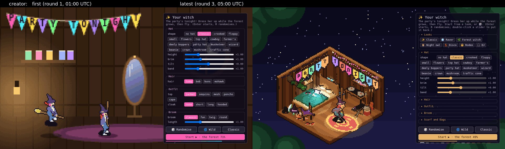
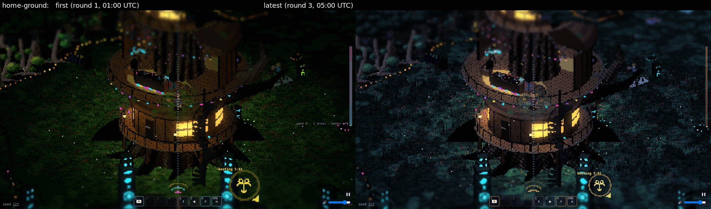
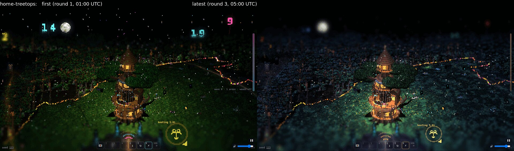
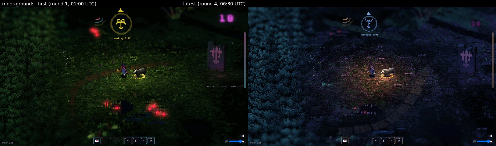
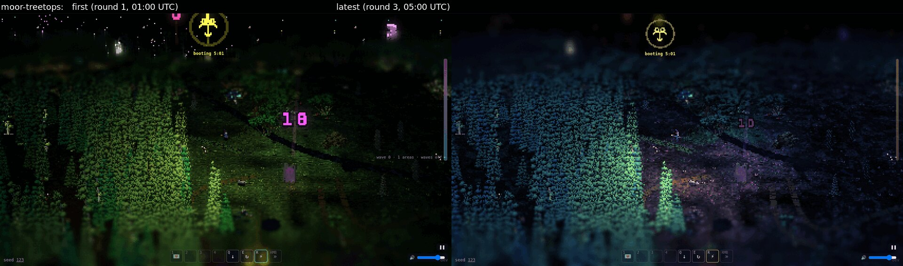
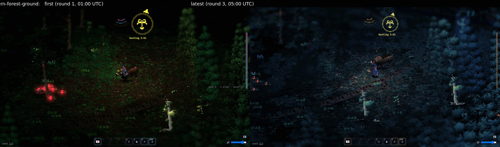
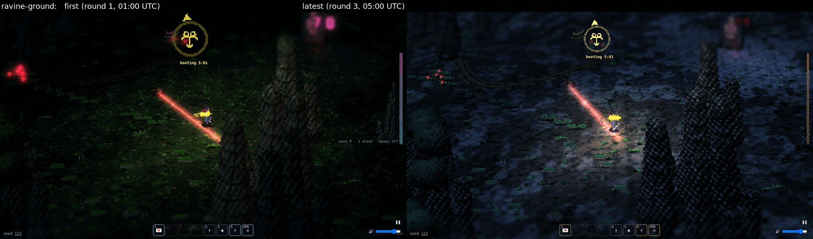
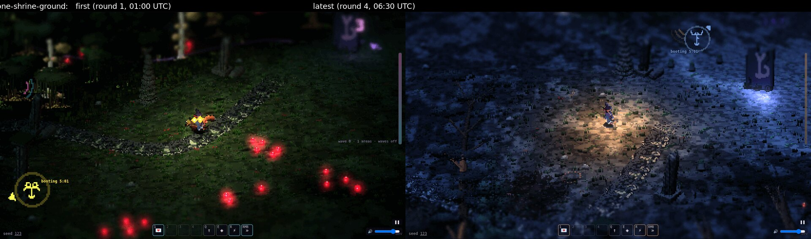
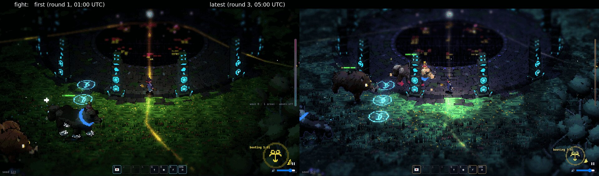

# The night's art review: first against latest

Ed's brief (2026-10-06): "take sets of screenshots of the game and think about what will make the visuals more coherent and aesthetic, keep iterating". Later the same night he added: "a spooky dark forest with a party in it."

Every shot uses the same seed (123), the same places and the same window (1280×720), at night as the game is:
- **First:** `claude/prototype` at 5766018, about 01:00 UTC (`round-01b/`, re-shot with the fixed capture script).
- **Latest:** round 3, about 05:00 UTC (`round-03/`). That's prototype at d02b5d8 plus three open PRs: #208 (round 2's lighting fixes), #205 (night palette) and #212 (her magic).

Each picture in `compare/` has the first on the left and the latest on the right.

| | |
|---|---|
| **The creator** |  |
| **Home, on the ground** |  |
| **Home, from the treetops** |  |
| **The moor** |  |
| **The moor, from the treetops** |  |
| **The fern forest** |  |
| **The ravine** |  |
| **The stone shrine** |  |
| **A fight at home** |  |

The latest set also has a shot the first set didn't take: a partified area away from home, at `round-03/default-party-ground.png` and `default-party-treetops.png`. It is the clearest picture of "a spooky dark forest with a party in it" so far.

## What changed overnight

1. **A cold, dark wood with the party as the warm light** (rendering, #184–#199 and #208):
   - per-area fog and tint;
   - the party's lights as warm amber pools;
   - the moon on the treetops, so the forest's shape reads from above.
2. **The witch reads in the dark** (#199): a cool moonlit rim and her own light on her. In round 1 she was the floor's value and hard to find.
3. **Each area has its own floor at night** (art builder 1, #205): the moor violet-brown heather, the ravine grey rock, the shrine pale flags. Every green is a dark blue-green, never lime.
4. **The party is warm, not six neons** (art builder 3, #198):
   - amber lanterns and fairy lights, with each area's own neon on one bulb in three;
   - balloons lit by the lights;
   - pools with a moonlit rim instead of black holes.
5. **A quiet UI** (golf, #188 and #209): one amber accent, smaller countdowns, the creator in the same amber, and the creator's new isometric bedroom (#143).
6. **Creatures' eyes in the dark** are small, crisp red pairs, not blurred red discs.

## Still to do (round 3's notes)

- The forest has swung a little too far into blue-violet. It should be blue-green with violet in the shadows.
- The shrine's pale flags are brighter than the witch.
- Her light doesn't show in the fern forest.
- A lime glow sits on the ground at the front of home's dancefloor.
- A checkerboard dither on the dark crowns and rock spires reads as a screen door.
- Creature attack visuals (Ed's second direction): #193 and #203 are in review and not yet in these shots.
- **Bold against ref is still Ed's call.** In the fight at home both read (`round-03/bold-fight.png`, `ref-fight.png`). On the dark moor the witch disappears in both (`bold-moor-ground`, `ref-moor-ground`), and that's briefed to rendering. So compare them in the party's light, not on the dark moor.

Round by round: `round-01/` (its area shots were off the map), `round-01b/`, `round-02/` and `round-03/`. Each has a README with its critique and briefs. The running thread is PR #177.
