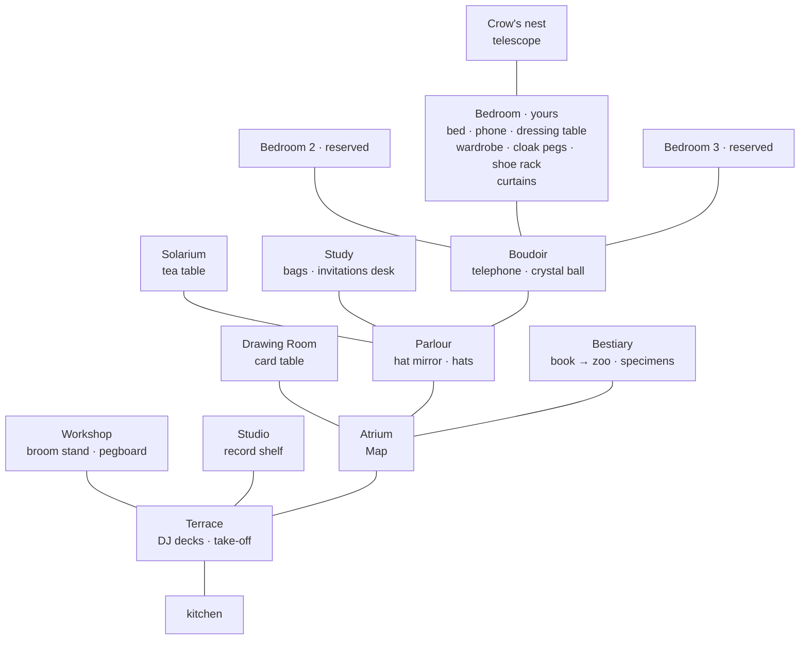

# Ed's treehouse layout (2026-10-22)

Sketch: ed-sketch.png. Rooms are iso boxes on two diagonal axes, with small square hubs at the crossings, joined by corridors. One iso floor.

```mermaid
graph TD
  garage --- middleHub
  cardRoom --- upperHub
  teaRoom --- dressing
  bedroom2 --- lounge
  crowsNest --- bedroom
  bedroom --- lounge
  bedroom3 --- lounge
  bags --- dressing
  lounge --- dressing
  dressing --- upperHub
  studio --- middleHub
  upperHub --- middleHub
  bestiary --- upperHub
  middleHub --- kitchen
  upperHub[Atrium<br>Map]
  middleHub[Terrace<br/>DJ decks · take-off]
  studio[Studio<br/>record shelf]
  bedroom3[Bedroom 3 · reserved]
  bedroom[Bedroom · yours<br/>bed · phone · dressing table<br/>wardrobe · cloak pegs · shoe rack<br/>curtains]
  bedroom2[Bedroom 2 · reserved]
  lounge[Boudoir<br>telephone · crystal ball]
  crowsNest[Crow's nest<br/>telescope]
  dressing[Parlour<br/>hat mirror · hats]
  bags[Study<br/>bags · invitations desk]
  garage[Workshop<br/>broom stand · pegboard]
  teaRoom[Solarium<br/>tea table]
  cardRoom[Drawing Room<br/>card table]
  bestiary[Bestiary<br/>book → zoo · specimens]
```
