# Overnight showcase (2026-10-06)

Sections 1, 2 and 4 were re-shot at about 06:50 on `claude/prototype` at `08b67ba5`. Sections 3, 5 and 6 are from the first set, at `1d0f98bb`. Every shot uses seed 123, 1280×720, the game's normal camera, headless Chromium with software GL. Clips were stepped by hand at fixed steps, so they play smoother than the machine that recorded them. The capture scripts are in `tools/smoke/` (`showcase.cjs`, `party-life.cjs`, `party-join.cjs`, `magic-letters.cjs`, `magic-sigils.cjs`, `magic-dodge.cjs`). Rerun any of them after `npm run build`.

## 1. A spooky dark forest, with the party as warm pools
Rendering's spooky light (#184, #189, #195, #199) gives each area its own fog and tint, a moonlit rim on every character and warm amber party light. Her own light pool is amber, not lime, and it shows on dark floors (#217).

| | On the ground | From the treetops |
|---|---|---|
| Home | 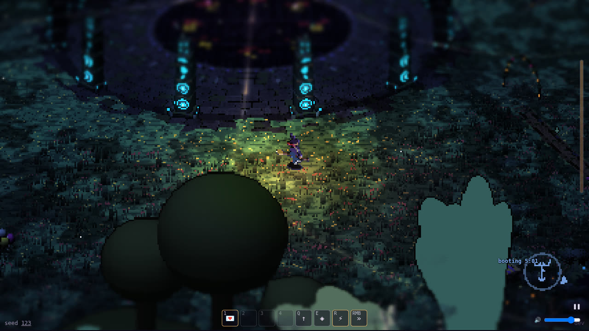 | 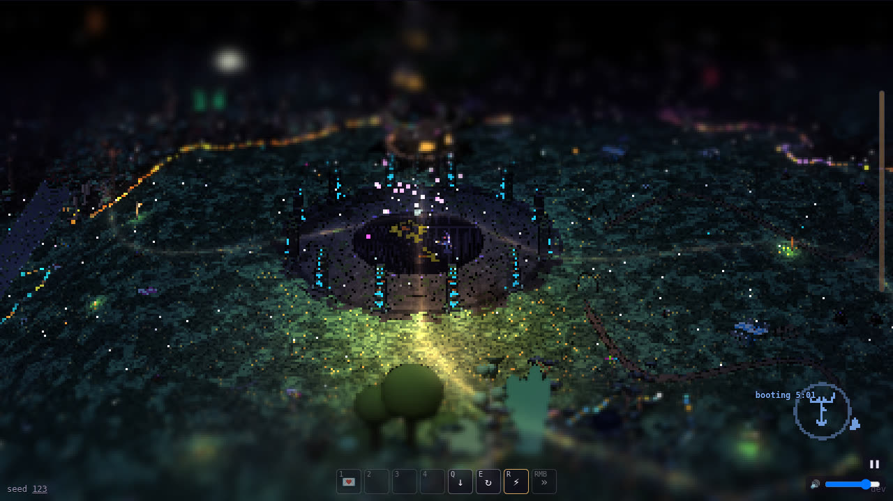 |
| The moor (cell 8,9) | 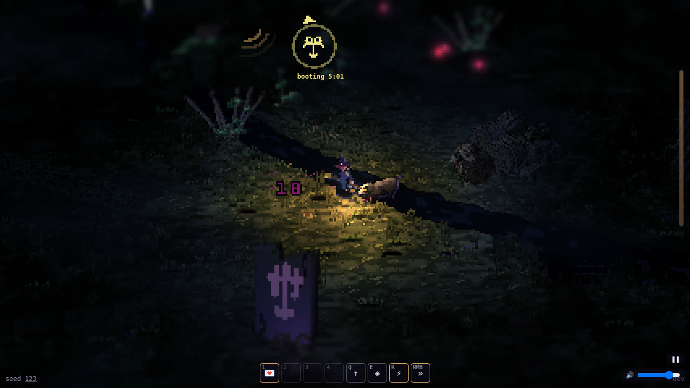 | 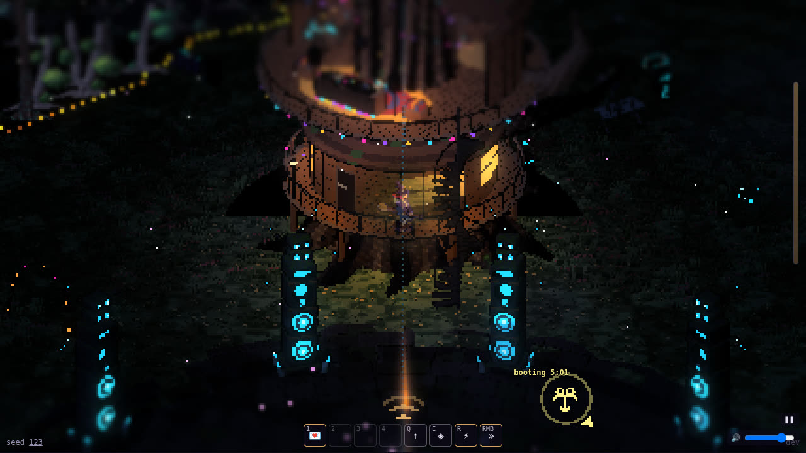 |
| The fern forest (cell 7,10) | 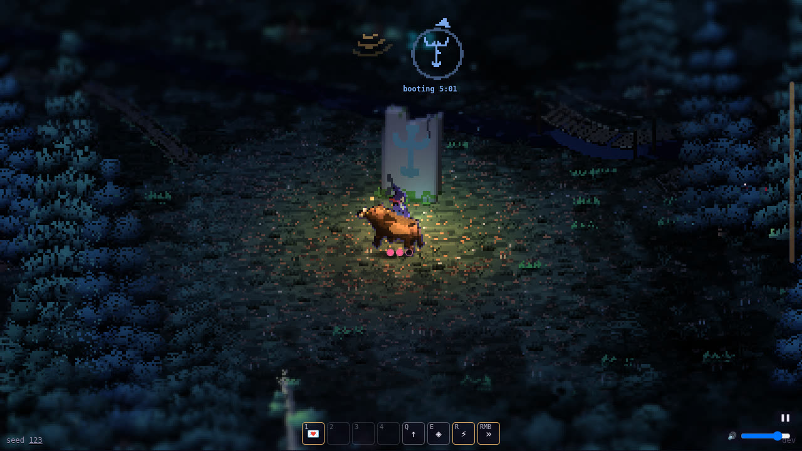 | 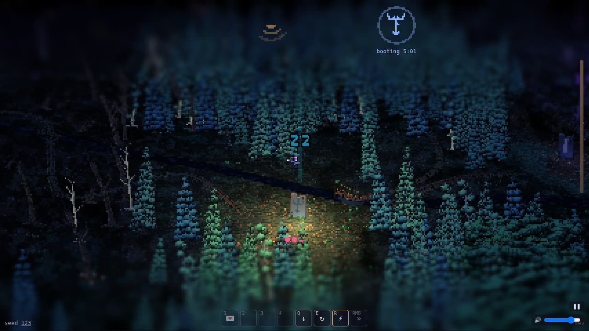 |

**Now in these shots:**
- #205: each area's floor at night;
- #208: round 2's lighting fixes, including the moon on the treetops, the berries' crisp glow and an amber ley line;
- #198: the warm party decor, which came in through #201.

## 2. Party life (#200, #206)
- **The guests:** happy creatures gather at the party's picnics, tables, balloons and lanterns, not only round the soundsystem. They stand in a row behind each place, the big ones at the back.
  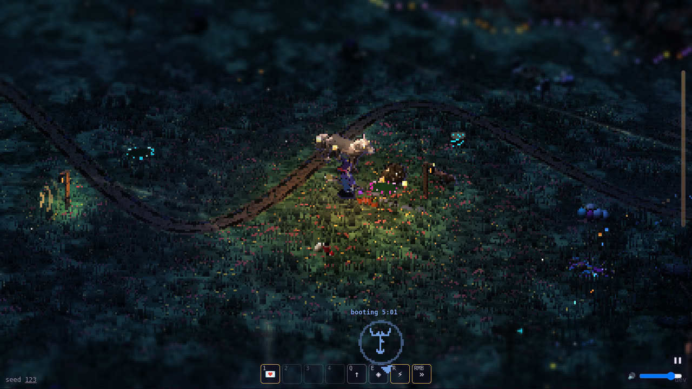
- **The dancing:** each guest has its own dance on the beat (a bounce, a sway, a hop or a bob), feet tapping, with warm amber twinkles.
  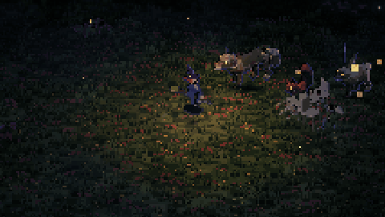
- **Joining:** a burst of amber confetti in the creature's own neon, and a hop.
  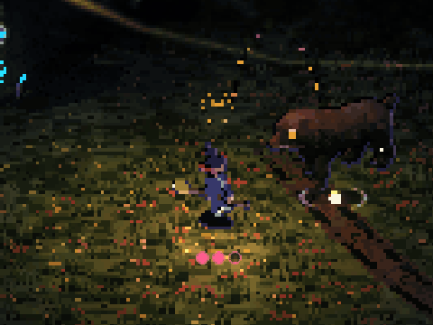

## 3. Her magic in the night palette (#212, #213, #215)
- **💌s:** a warm trail behind each one, a rose ring and amber sparks on a hit, and a soft puff where one lands on the ground. There are no white flashes.
  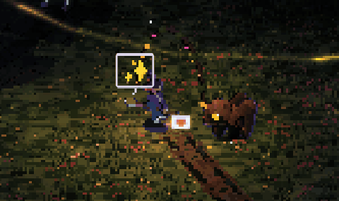
- **A sigil put down:** a deep amber ring opens round the rune, and motes of its creature's neon rise.
  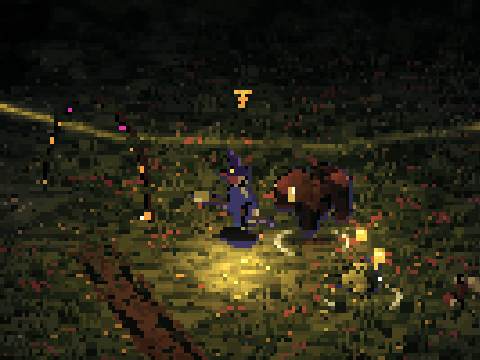
- **Sigils cycled in the treetops:** the new bottom one flares.
  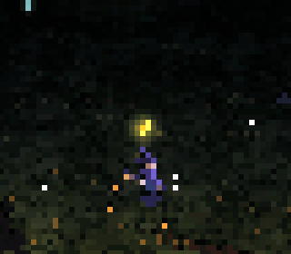
- **The dodge:** a moonlit blue-violet afterimage and smears along the blink, where before it was white blobs.
  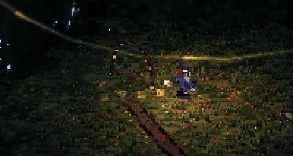
- **The broom:** a few amber sparks as she flies.
  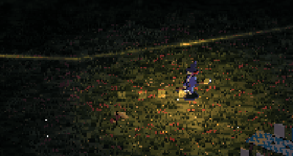

## 4. Creature attacks (#193, #203, now merged)
A debug arena (`?arena=wolf*2@1,boar*2@1,beetle*2@1`): wild young creatures at her by the dancefloor, at 1/20 s a frame. It shows art builder 2's attack visuals, with telegraphs, hit sparks and trait marks.

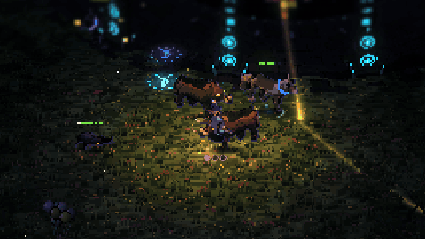

## 5. The creator, which is also the loading screen
- **Loading:** the game opens straight into the creator in her bedroom. The fairy lights fill as the forest loads (0%, 10%, 41%… one frame every 4 to 7 s on this slow machine), and she idles on the rug. It's in the HUD's amber (#209).
  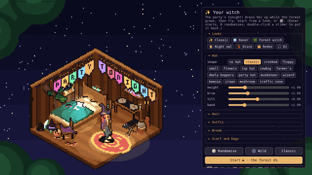
- **The creator:** 

On a slow machine the room now redraws less often while the forest grows, so loading no longer stalls with the creator open (#209).

## 6. The calm amber HUD (#188)
One accent, lantern amber; a quiet wave dial; and the action bar.

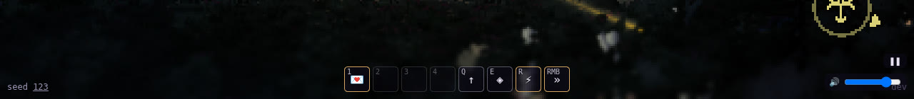

The full frames in section 1 show it in place.
